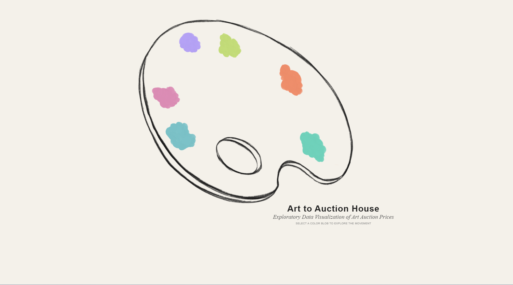
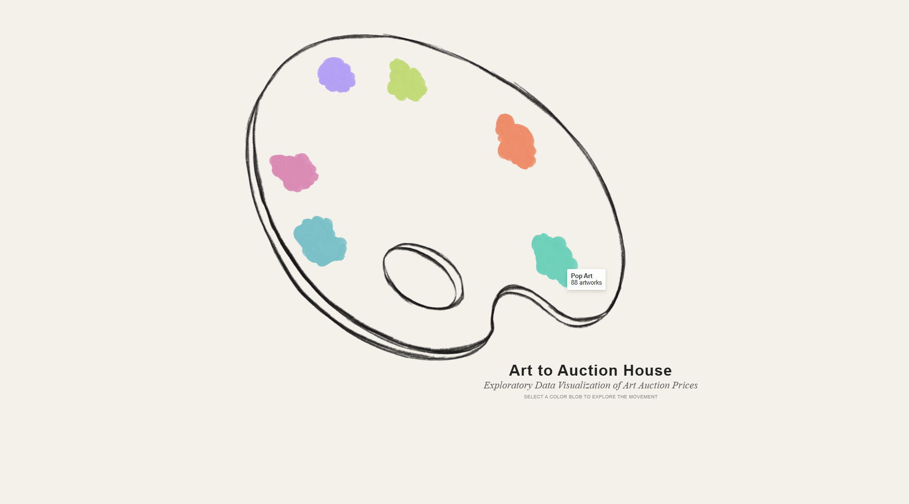
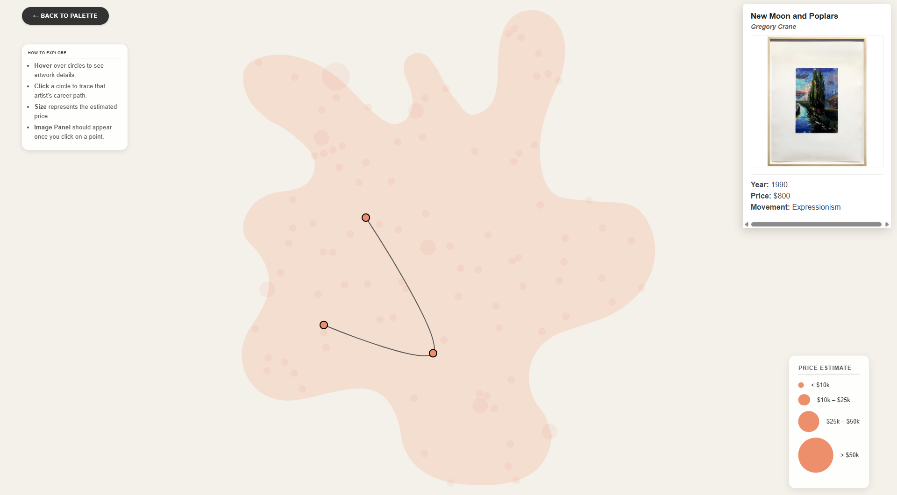

# Art to Auction House
**Exploratory Data Visualization of Art Auction Prices**

This project is a bespoke, highly interactive data visualization built with D3.js that explores art auction prices across various artistic movements. Moving away from traditional chart formats, this visualization uses a thematic, custom-illustrated painter's palette and dynamic paint splatter boundary zones to create an engaging data exploration experience.

## Technical Stack
* **Frontend:** HTML5, CSS3, Vanilla JavaScript
* **Data Visualization:** D3.js (v7)
* **Assets:** Custom graphics drawn in Procreate, converted to dynamic SVG paths

## How to Navigate

### 1. The Palette View
When you first load the visualization, you are presented with a wooden painter's palette containing different blobs of color. Each color represents a specific art movement (e.g., Pop Art, Expressionism).
* **Hover** over any paint blob to reveal a tooltip showing the name of the movement and the total number of artworks in the dataset for that category.

### 2. The Splatter View (Bubble Chart)
Click on a color blob to dive into that specific movement. The palette will fade away, and a large paint splatter will expand on the screen. 
* A custom D3 force simulation pulls the data points (bubbles) onto the screen, dynamically containing them strictly within the bounds of the irregular splatter shape. 
* **Dynamic Sampling:** The data is dynamically sampled. Every time you click a color on the palette to enter this view, it refreshes to display a new set of data points.
* **Price Sizing:** The radius of each bubble represents the estimated auction price of the artwork (larger bubbles indicate a higher price).

### 3. Exploring Artworks & Career Paths
Once inside the Splatter View, you can interact with the individual data points:
* **Hover** over any bubble to see a quick tooltip with the artwork's Title, Artist, Year, and Price.
* **Click** a bubble to lock in your selection. This opens the Image Panel on the right side of the screen, displaying a preview of the artwork alongside its full details.

**Tracing the Artist's Career:**
If the dataset contains multiple paintings by the selected artist within that movement, clicking their artwork triggers a career trace. A smooth, animated line will draw across the screen, connecting the artist's works and tracing their career path chronologically from their earliest painting to their latest.

### 4. Resetting the View
To explore a different art movement, simply click the "<- Back to Palette" button in the top left corner. The view will gracefully transition back to the main palette, allowing you to select a new color and generate a fresh set of data points.
